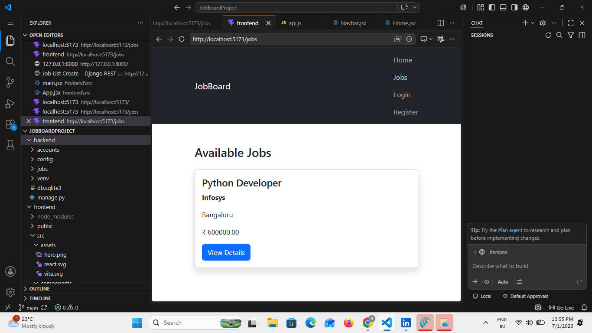
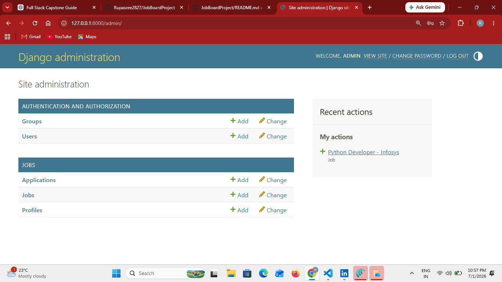

# Job Board Project

## Description
A Full Stack Job Board application built using Django REST Framework and React.

## Features
- User Registration
- JWT Authentication
- Job Listings
- Job Details
- Django Admin Panel
- REST API Integration

## Tech Stack

### Backend
- Python
- Django
- Django REST Framework
- Simple JWT

### Frontend
- React
- Vite
- React Router
- Axios

### Database
- SQLite

## Project Structure

JobBoardProject/
│
├── backend/
├── frontend/

## Setup Instructions

### Backend

```bash
cd backend
python -m venv venv
venv\Scripts\activate
pip install -r requirements.txt
python manage.py runserver
```

### Frontend

```bash
cd frontend
npm install
npm run dev
```

## API Endpoints

- Login
- Register
- Jobs
- Job Details

## Author

Rupasree

## Screenshots

### Job Listings



### Django Admin


